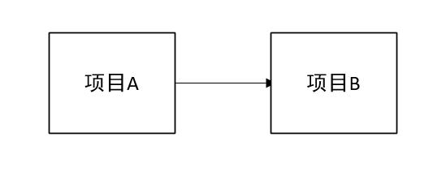
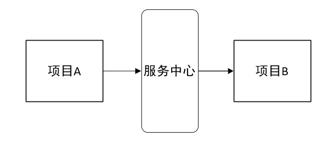
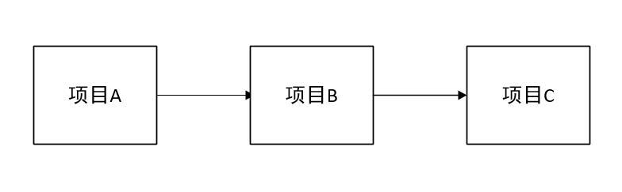
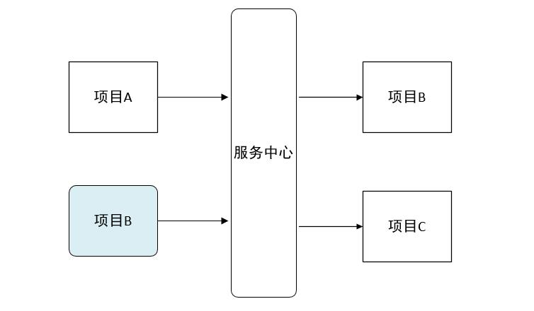
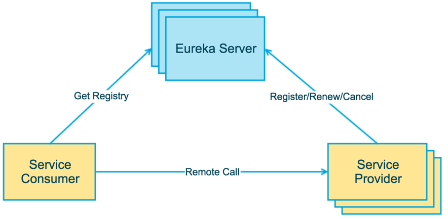

# Eureka服务注册与发现

### Spring Cloud Netflix 
该项目是Spring Cloud的子项目之一，主要内容是对Netflix公司一系列开源产品的包装，它为Spring Boot应用提供了自配置的Netflix OSS整合。通过一些简单的注解，开发者就可以快速的在应用中配置一下常用模块并构建庞大的分布式系统。它主要提供的模块包括：服务发现（Eureka），断路器（Hystrix），智能路由（Zuul），客户端负载均衡（Ribbon）等

 

### Spring Cloud Eureka
Spring Cloud Eureka 是 Spring Cloud Netflix 组件的一部分。它基于Netflix Eureka做了二次封装，来实现微服务架构中的服务治理功能，即服务注册和发现等功能。Eureka Server 作为服务注册功能的服务器，它是服务注册中心。而系统中的其他微服务，作为 Eureka 的客户端连接到 Eureka Server，并维持心跳连接。这样系统的维护人员就可以通过 Eureka Server 来监控系统中各个微服务是否正常运行。Spring Cloud 的一些其他模块（比如Zuul）就可以通过 Eureka Server 来发现系统中的其他微服务，并执行相关的逻辑。

> Eureka由两个组件组成：Eureka服务器和Eureka客户端。Eureka服务器也叫作服务注册中心。Eureka客户端是一个java客户端，用来简化与服务器的交互、作为轮询负载均衡器，并提供服务的故障切换支持。Netflix在其生产环境中使用的是另外的客户端，它提供基于流量、资源利用率以及出错状态的加权负载均衡。

 

### 为什么要使用服务治理
在一个微服务系统中，可能其中的小型服务几十个以上，服务之间互相依赖调用，如果没有服务治理的话，每一个小型服务都需要维护一个依赖的服务列表，包括ip、端口等，如果其中一个服务修改了， 可能所有依赖它的服务都需要重新修改，这个工程量是很大的，而且这么多服务还要考虑各种命名冲突等问题。如果有了服务治理功能，我们就可以通过它提供的服务注册和服务发现机制来实现对微服务应用实例的自动化管理。

 

### 服务注册
在服务治理框架中，通常都会构建一个注册中心，每个服务向注册中心登记自己提供的服务，将主机、端口号、版本号、通信协议等附加信息告知注册中心，注册中心按服务分类组织服务清单。当这些服务启动并向注册中心注册自己的服务后，注册中心就会维护一个服务清单，还以心跳的方式去监测清单中的服务是否可用，若不可用则从服务清单剔除，达到排除故障的效果。

 
### 服务发现
由于在服务治理框架下运行，服务间的调用不在通过指定具体的实例地址来实现，而是通过向服务名发起请求调用实现。所以服务调用方并不清楚服务提供方的实际位置。因此，服务调用方会向注册中心咨询服务，获取可以被调用的服务实例清单，以实现对具体实例服务的访问，而且这里默认采用了轮询的方式实现客户端负载均衡。

上图简要描述了Eureka的基本架构，由服务端和客户端组成，客户端可以拆成两种角色—服务提供者和服务消费者。

> Eureka Server（服务端）：服务注册中心，提供服务注册和发现
> Service Provider（客户端）：服务提供者，将自身服务注册到Eureka，为服务消费者提供服务，可以是Spring Boot应用也可以是其他技术平台且遵循Eureka通信机制的应用。
> Service Consumer（客户端）：服务消费者，从Eureka获取注册服务列表，从而能够消费服务，可以通过Ribbon或者Feign实现消费。
> 一般情况下，服务客户端既是服务提供者也是服务消费者。

 

### 服务中心
服务中心又称注册中心，管理各种服务功能包括服务的注册、发现、熔断、负载、降级等，比如dubbo admin后台的各种功能。

有了服务中心调用关系会有什么变化，画几个简图来帮忙理解

项目A调用项目B

正常调用项目A请求项目B

有了服务中心之后，任何一个服务都不能直接去掉用，都需要通过服务中心来调用

项目A调用项目B，项目B在调用项目C

这时候调用的步骤就会为两步：第一步，项目A首先从服务中心请求项目B服务器，然后项目B在从服务中心请求项目C服务。

上面的项目只是两三个相互之间的简单调用，但是如果项目超过20个30个呢，在15年底的时候我司分布式的项目就达到了二十几个，画一张图来描述几十个项目之间的相互调用关系全是线条，任何其中的一个项目改动，就会牵连好几个项目跟着重启，巨麻烦而且容易出错。通过服务中心来获取服务你不需要关注你调用的项目IP地址，由几台服务器组成，每次直接去服务中心获取可以使用的服务去调用既可。

由于各种服务都注册到了服务中心，就有了去做很多高级功能条件。比如几台服务提供相同服务来做均衡负载；监控服务器调用成功率来做熔断，移除服务列表中的故障点；监控服务调用时间来对不同的服务器设置不同的权重等等。

说Eureka之前我先八卦一下Netflix

### Netflix
以下介绍来自于百度百科：

> Netflix是一家美国公司，在美国、加拿大提供互联网随选流媒体播放，定制DVD、蓝光光碟在线出租业务。该公司成立于1997年，总部位于加利福尼亚州洛斯盖图，1999年开始订阅服务。2009年，该公司可提供多达10万部DVD电影，并有1千万的订户。2007年2月25日，Netflix宣布已经售出第10亿份DVD。HIS一份报告中表示，2011年Netflix网络电影销量占据美国用户在线电影总销量的45%。

我第一次看到这个单词的时候，是在各种美剧或者电影的开头，Netflix拍摄的代表性的美剧有《纸牌屋》、《毒枭》、《怪奇物语》。后来研究springcloud的时候发现了Netflix公司，就在想它们是不是同一家公司，经过核对github上面邮件后缀判定确实是同一家公司，其实springcloud的微服务就基于Netflix公司的开源产品来做的。

Netflix的开源框架组件已经在Netflix的大规模分布式微服务环境中经过多年的生产实战验证，正逐步被社区接受为构造微服务框架的标准组件。Spring Cloud开源产品，主要是基于对Netflix开源组件的进一步封装，方便Spring开发人员构建微服务基础框架。对于一些打算构建微服务框架体系的公司来说，充分利用或参考借鉴Netflix的开源微服务组件(或Spring Cloud)，在此基础上进行必要的企业定制，无疑是通向微服务架构的捷径。

### Eureka
按照官方介绍：

>Eureka is a REST (Representational State Transfer) based service that is primarily used in the AWS cloud for locating services for the purpose of load balancing and failover of middle-tier servers.

Eureka 是一个基于 REST 的服务，主要在 AWS 云中使用, 定位服务来进行中间层服务器的负载均衡和故障转移。

Spring Cloud 封装了 Netflix 公司开发的 Eureka 模块来实现服务注册和发现。Eureka 采用了 C-S 的设计架构。Eureka Server 作为服务注册功能的服务器，它是服务注册中心。而系统中的其他微服务，使用 Eureka 的客户端连接到 Eureka Server，并维持心跳连接。这样系统的维护人员就可以通过 Eureka Server 来监控系统中各个微服务是否正常运行。Spring Cloud 的一些其他模块（比如Zuul）就可以通过 Eureka Server 来发现系统中的其他微服务，并执行相关的逻辑。

Eureka由两个组件组成：Eureka服务器和Eureka客户端。Eureka服务器用作服务注册服务器。Eureka客户端是一个java客户端，用来简化与服务器的交互、作为轮询负载均衡器，并提供服务的故障切换支持。Netflix在其生产环境中使用的是另外的客户端，它提供基于流量、资源利用率以及出错状态的加权负载均衡。

用一张图来认识以下：

上图简要描述了Eureka的基本架构，由3个角色组成：

> 1、Eureka Server
> 提供服务注册和发现
> 
> 2、Service Provider
> 服务提供方
> 将自身服务注册到Eureka，从而使服务消费方能够找到
> 
> 3、Service Consumer
> 服务消费方
> 从Eureka获取注册服务列表，从而能够消费服务
> 