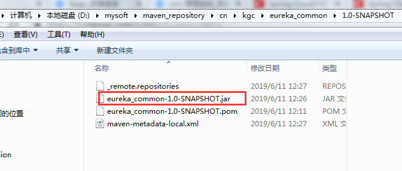
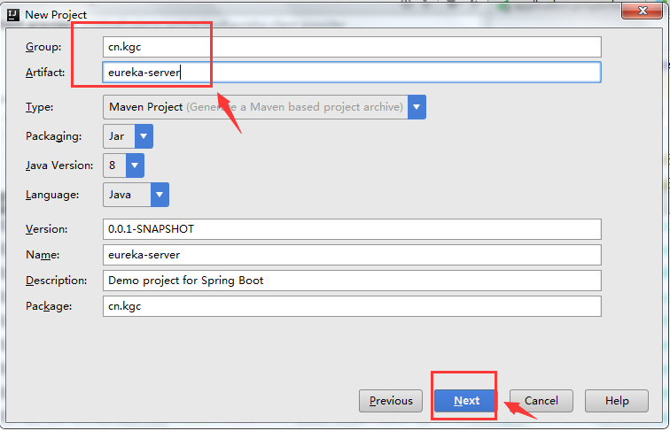

##### 一. 因为使用一个注册中心服务器端，n个客户端：n个生产者客户端、n消费者客户端....,所有的客户端最好的方式就是通过对象传递参数，因此需要创建一个公共组件项目，为n个客户端传值提供方便

##### 二、创建公共组件项目

1.创建公共组件项目，因为只是数据传输层共用，因此创建普通maven项目就好


2.给公共组件项目起名字


 3.maven的配置


4.同理，为了在一个窗口好查阅，我们创建独立的项目模块


5.创建如下项目结构


6.编辑Classes.java类

```java
package cn.kgc.vo;

import java.io.Serializable;

/**
 * Created by Administrator on 2019/6/11.
 */
public class Classes implements Serializable{
    private Integer cid;
    private String cname;

    public Classes() {
    }

    public Classes(Integer cid, String cname) {
        this.cid = cid;
        this.cname = cname;
    }

    public Integer getCid() {
        return cid;
    }

    public void setCid(Integer cid) {
        this.cid = cid;
    }

    public String getCname() {
        return cname;
    }

    public void setCname(String cname) {
        this.cname = cname;
    }

    @Override
    public String toString() {
        return "Classes{" +
                "cid=" + cid +
                ", cname='" + cname + '\'' +
                '}';
    }
}
```
 

7编辑Student.java类

```java
package cn.kgc.vo;

import java.io.Serializable;

/**
 * Created by Administrator on 2019/6/11.
 */
public class Student implements Serializable{
    private Integer sid;
    private String sname;
    private String password;
    private String subject;
    private Double result;
    private Integer cid;

    public Student() {
    }

    public Student(Integer sid, String sname, String password, String subject, Double result, Integer cid) {
        this.sid = sid;
        this.sname = sname;
        this.password = password;
        this.subject = subject;
        this.result = result;
        this.cid = cid;
    }

    public Integer getSid() {
        return sid;
    }

    public void setSid(Integer sid) {
        this.sid = sid;
    }

    public String getSname() {
        return sname;
    }

    public void setSname(String sname) {
        this.sname = sname;
    }

    public String getPassword() {
        return password;
    }

    public void setPassword(String password) {
        this.password = password;
    }

    public String getSubject() {
        return subject;
    }

    public void setSubject(String subject) {
        this.subject = subject;
    }

    public Double getResult() {
        return result;
    }

    public void setResult(Double result) {
        this.result = result;
    }

    public Integer getCid() {
        return cid;
    }

    public void setCid(Integer cid) {
        this.cid = cid;
    }

    @Override
    public String toString() {
        return "Student{" +
                "sid=" + sid +
                ", sname='" + sname + '\'' +
                ", password='" + password + '\'' +
                ", subject='" + subject + '\'' +
                ", result=" + result +
                ", cid=" + cid +
                '}';
    }

}
```
 

8.因为在企业中 项目都是独立调用的，也就意味着其他eureka客户端会互相调用，会公共引用公共组件的类，那么独立的项目引用的方式就是 将公共组件项目使用maven打成jar包或war包，存入maven仓库，供所有人公共调用，因此我们下面使用现有的idea工具将项目打成war包，打入我们自己的maven仓库，如果是在企业中，则将项目达到公共私服的maven库中，

>注意：使用idea中将项目打成war包存入maven仓库时，一定一定注意 在idea中已经配置过自己的maven本地仓库地址




看到此处我们的公共组件就已经打成jar文件

 

##### 三、创建eureka服务端项目

1.创建项目


2.选择创建项目的类型


3.输入group 的值和模块名称



4. 因为我们创建的是eureka服务器端，因此只产生服务器依赖


5.指定工程存放路径和项目即模块名称


6.查看已经创建好的项目结构


7.编辑application.properties属性文件

在默认设置下，该服务注册中心也会将自己作为客户端来尝试注册它自己，所以我们需要禁用它的客户端注册行为，只需要在application.yml中增加如下配置：

```properties
#spring.application.name表示当前微服务注册到Eureka Server中的名字，同事需要指定Eureka Server地址
spring.application.name=eureka-server

#设置当前服务的端口号
server.port=8761

#register-with-eureka ：表示是将自己注册到Eureka Server，默认为true。
#因为当前应用就是Eureka Server，所以将其设置位false
eureka.client.register-with-eureka=false

#fetch-registry ：表示是否从Eureka Server获取注册信息，默认为true。不需要同步数据就将其设为false
eureka.client.fetch-registry=false

#defaultZone ：设置与Eureka Server交互的地址，
#查询服务和注册服务都需要依赖这个地址。默认是http://localhost:8761/eureka ；
#多个地址可使用 , 分隔。
eureka.client.serviceUrl.defaultZone=http://localhost:${server.port}/eureka/
```
 

8.给启动类添加eureka服务器端开启的注解

在启动类中添加注解@EnableEurekaServer启动一个服务注册中心提供给其他应用进行对话。

```java
package cn.kgc;

import org.springframework.boot.SpringApplication;
import org.springframework.boot.autoconfigure.SpringBootApplication;
import org.springframework.cloud.netflix.eureka.server.EnableEurekaServer;
//开启注册中心服务端
@EnableEurekaServer
@SpringBootApplication
public class EurekaServerApplication {

    public static void main(String[] args) {
        SpringApplication.run(EurekaServerApplication.class, args);
    }

}
```
 

9.启动服务端，并在浏览器访问注册中心


 

此帖子为原创

作者：红酒人生

转载请注明出处：https://www.cnblogs.com/holly8/p/11002943.html